# Goals of the project
Identify individual fibers and determine their length, width, area, orientation, curvature, and density. Additionally, we would like to determine the porosity (ratio of "empty" space to the total image area). To check the analysis, it would be helpful if one of the outputs included a version of the input image(s) with brightly colored traces over the extracted fibers.

<!-- TOC START min:1 max:5 link:true asterisk:false update:true -->
- [Goals of the project](#goals-of-the-project)
- [Goals of this document](#goals-of-this-document)
- [Dataset details](#dataset-details)
- [Configuring the input modules](#configuring-the-input-modules)
    - [Excluding images from analysis within the Images module](#excluding-images-from-analysis-within-the-images-module)
    - [Capturing metadata using the Metadata module](#capturing-metadata-using-the-metadata-module)
    - [Creating an image set using the NamesAndTypes module](#creating-an-image-set-using-the-namesandtypes-module)
- [Building the pipeline](#building-the-pipeline)
    - [Segmenting fibrils](#segmenting-fibrils)
        - [Removing bright debris](#removing-bright-debris)
        - [Enhancing fibers for detection](#enhancing-fibers-for-detection)
        - [Detecting fibrils as objects](#detecting-fibrils-as-objects)
        - [Cropping out the image edges](#cropping-out-the-image-edges)
    - [Adding measurement modules and exporting the data](#adding-measurement-modules-and-exporting-the-data)
- [Data analysis](#data-analysis)
<!-- TOC END -->

# Goals of this document
The goal of this document is to show how the fibril analysis pipeline was developed and to explain the underlying thought process. In doing so, we hope to empower other researchers to adapt this pipeline to their data.

A version of this document will be published as a blog post on the Broad Institute Imaging Platform blog, Measure Everything, Ask Questions Later.

# Dataset details
The first step in building any pipeline is understanding the underlying data. This dataset contains 16-bit images of human umbilical vein endothelial cells (HUVECs) taken at 40X magnification that contain three channels: phase contrast, 488, and 568. Our analysis will focus on the 488 channel only, which captures the connective tissue protein fibronectin labeled with GFP. The HUVECs were grown on three different substrates and imaged at three different timepoints.

# Configuring the input modules
This dataset is structured within folders for the timepoint (hr_6, hr_12, hr_24), the substrate (NP = nonporous, HP05 = 0.5 micron pores, HP3 = 3 micron pores), and the image replicate number (01, 02, 03, etc.). Each file name also contains this information and contains a separate channel (Phase, GFP, or TxRed). There are also 10X images within the dataset that we don't want to analyze in CellProfiler (contained within folders named [10X]):

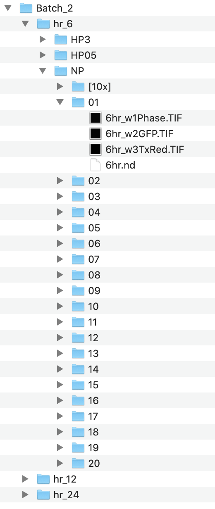

An overview of what we want to do with the input modules:
1. Exclude the 10X images
2. Capture the substrate, timepoint, and replicate data

### Excluding images from analysis within the Images module
The simplest way to exclude images from the analysis is to add a filter within the input module. Here I've applied filters to include only .tif files that do not contain the expression 10X. As you can see, the 10X folders are excluded from analysis, as are the .nd files that are the original files from the microscope:
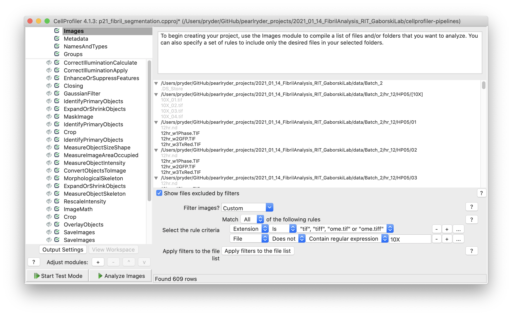

### Capturing metadata using the Metadata module
Next, we'll assign a substrate, timepoint, channel, and replicate category for each image using the Metadata module.

In this module, we apply the regular expression `.*/(?P<substrate>.*)/(?P<image>.*)` to the folder names in order to get the substrate and the replicate numbers.

We then extract the timepoints and the channels from the image names using the regular expression `^(?P<timepoint>.*)_w[0-9](?P<channel>.*).TIF`:
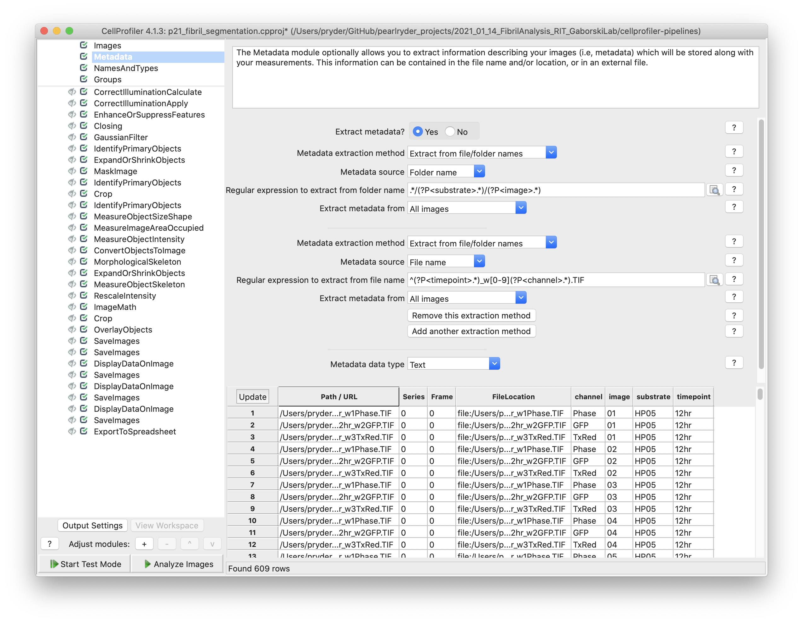

In doing so, each image now is assigned a substrate, timepoint, channel, and replicate number. The next step is to group those together using the NamesAndTypes module into an image set (all of the channels for a single field of view).

### Creating an image set using the NamesAndTypes module
Here, we apply names to images matching rules in order to create named GFP, Phase, and TxRed images:
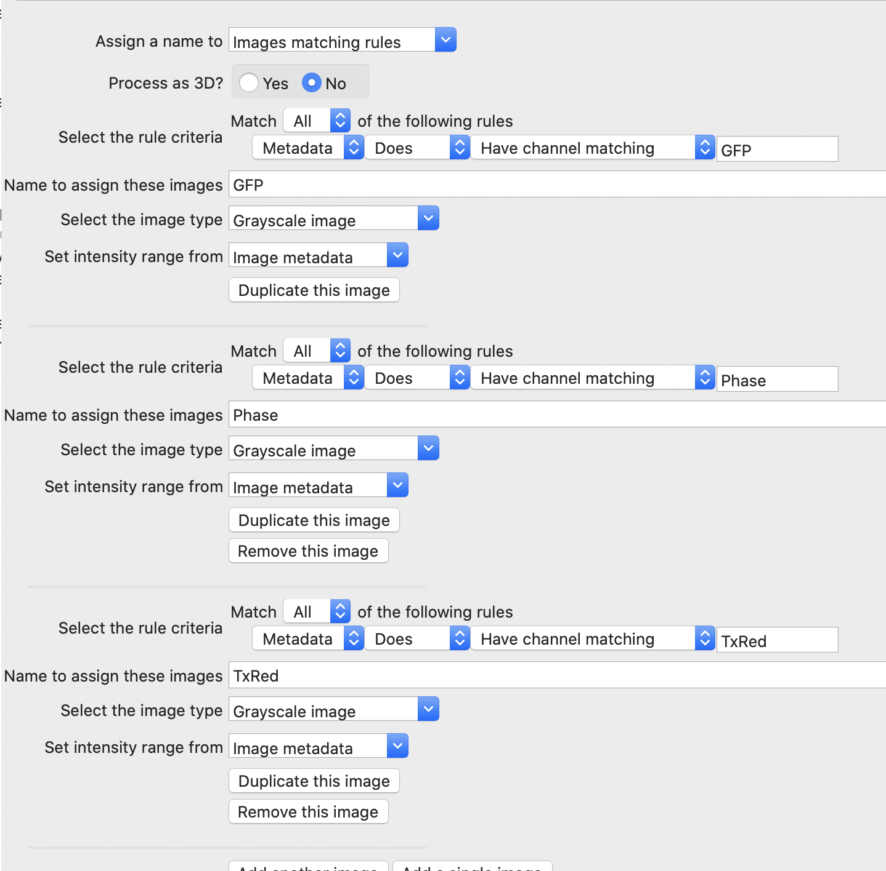

We then use metadata matching to associate each image into an image set that has the same substrate, timepoint, and replicate number:
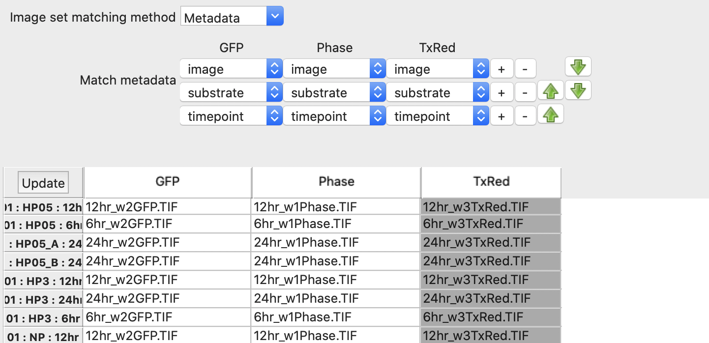

Note: in this particular example, I didn't end up using the data in the Phase or TxRed channels, which means they don't need to be included as images in the dataset (I could have included only the GFP images in the first step when importing images). When I built the pipeline, I wasn't sure if I'd want them, so I went ahead and included them here.

# Building the pipeline
### Segmenting fibrils
##### Removing bright debris
Now that the images have been imported, we can start building a pipeline. I start by examining the images and trying out the simplest thing I can think of.

Since we want to segment and measure fibril-like structures, I thought it was likely that I'd need to use the EnhanceOrSuppressFeatures module to apply a filter to enhance neurite-like structures. The first thing I tried was to apply the "tubeness" enhancement method (within the "neurites" feature type) to the GFP image. Doing so, however, resulted in debris being picked up as part of the cells. A common problem that I saw was debris being enhanced into fibril-like structures (lower left corner of this image):

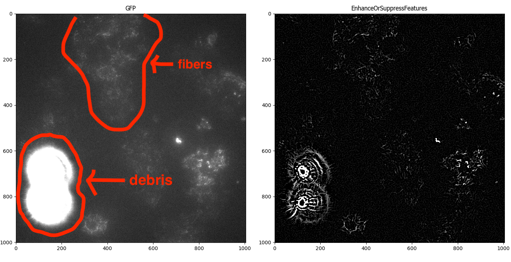

In order to reduce noise and get rid of this bright debris spots being included in the analysis, I wanted to first identify the bright debris spots as objects using IdentifyPrimaryObjects and then mask those areas of the image to exclude them from analysis.

First, I had to identify which method would be optimal for thresholding bright noise from the rest of the image. I experimented with this using a Threshold module, in order to get a good sense of how these automatic methods perform on the images without the extra steps performed by IdentifyPrimaryObjects. In a future step, I'll delete this Threshold module and switch to using IdentifyPrimaryObjects, which has more parameters for size filtering and adding lower and upper bounds, which are helpful (but can be distracting when you really want to focus on how the threshold method works!).

An early trial using an Otsu three-class threshold method was able to identify some of the bright spots in this image, almost all the way to the edge:
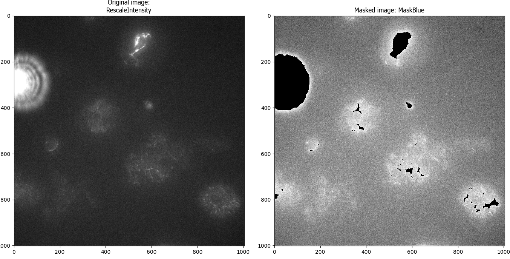

But the same thresholding method failed spectacularly when there was not bright debris in the image (most of the image was identified as above-threshold, which would result in losing a lot of good quality data):
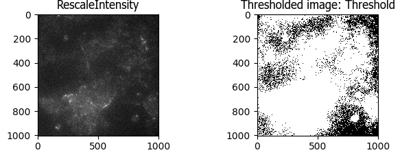

This led me to the Robust Background method, which works much better for this "good image" that lacks bright debris:
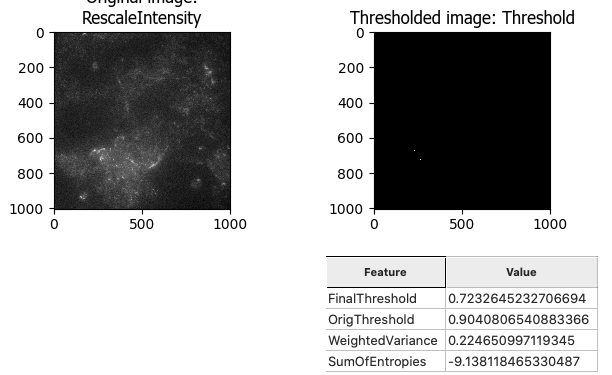

And the Robust Background does still pick up the bright spots:
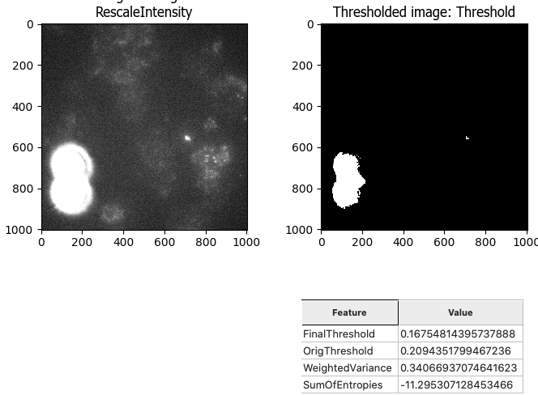

I noticed that the bright noise spots tend to have bright surrounding rings that are hard to accurately segment. For this reason, I added a Gaussian filter to smooth the image, which blurs the smaller surrounding rings with the background and allows me to capture only the brightest center spot as an object. In order to mask out those surrounding rings, I'll expand the center objects in the next step.  
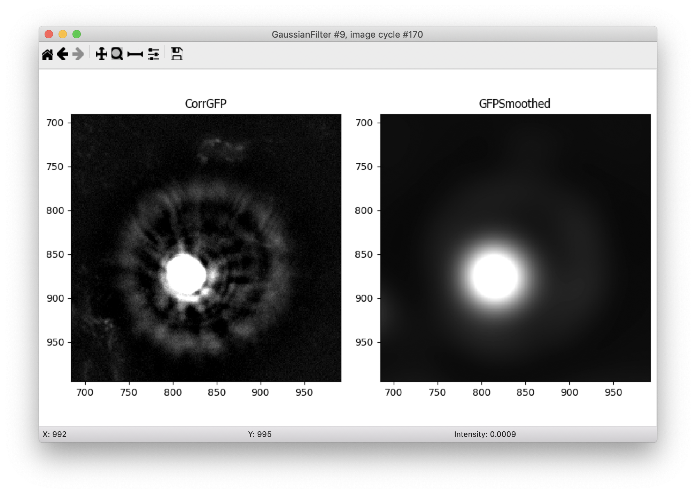

We're now ready to use IdentifyPrimaryObjects to create noise objects. I used quite a wide range of diameters for the objects for the size filters (10 - 500 pixels in diameter) and the Robust Background method that I previously determined works well for this type of image. I eliminated declumping since these bright debris are almost never close together and I tried out the default settings for the Robust Background on several images.

I found that the default settings for Robust Background were often a bit too permissive - they were capturing dim spots that were in fact bright fibrils within a cell rather than the bright debris I was trying to eliminate, such as the spot in the upper left corner of the image below. I needed to increase the threshold.

As documented in the CellProfiler help, the Robust Background algorithm trims the brightest and dimmest percentage of pixel intensities and then averages the remaining intensities and calculates the variance within that population. The threshold is then calculated by adding the average to N * the variance. When configuring this method, we set the lower and upper percentages that are trimmed, the methods for calculating the average, the method for calculating the variance, and the number of times to multiply that variance before adding it to the average in order to get the final pixel intensity threshold. Clear as mud, right?

The Robust Background method in this pipeline was using the mean and standard deviation for the averaging method and variance method, respectively. I didn't adjust that parameter. However, in order to increase the stringency of the threshold, I changed the "# of deviations" to add to the mean and tried out many different settings (10, 15, 25, etc.). For each of these, I tested the resulting segmentation across many different images - both those with bright noise debris and those without, as well as some that had very dim signal and others with very bright fibril signal. I ultimately settled on adding 10 standard deviations to the mean, which performed well across these conditions. Because the pixel intensity of the fibrils varies widely across this dataset, I also added a lower bound to the threshold of 0.02, which helps to prevent identifying bright fibrils as noise. Here's the final result - the bright spots are correctly identified but the dimmer ones are not:

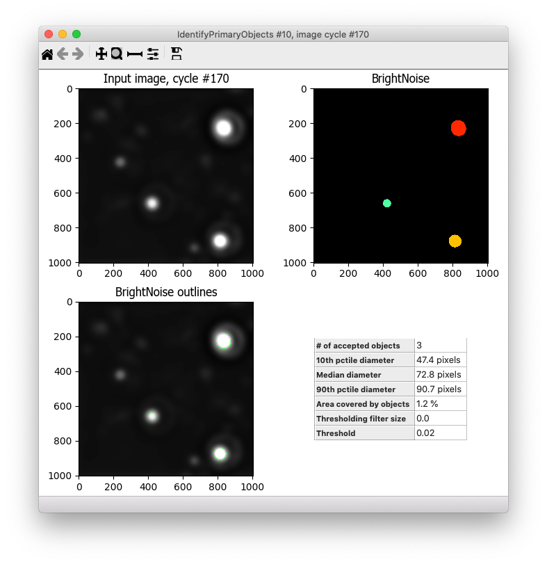

Finally, I add an ExpandOrShrinkObjects module in order to expand the bright noise spots detected with IdentifyPrimaryObjects by a specified number of pixels. I used the Workspace viewer to determine how many pixels to expand by and ultimately selected 100 pixels. In this Workspace, I've set the IdentifyPrimaryObjects output to have a magenta outline while the expanded noise has a green outline:
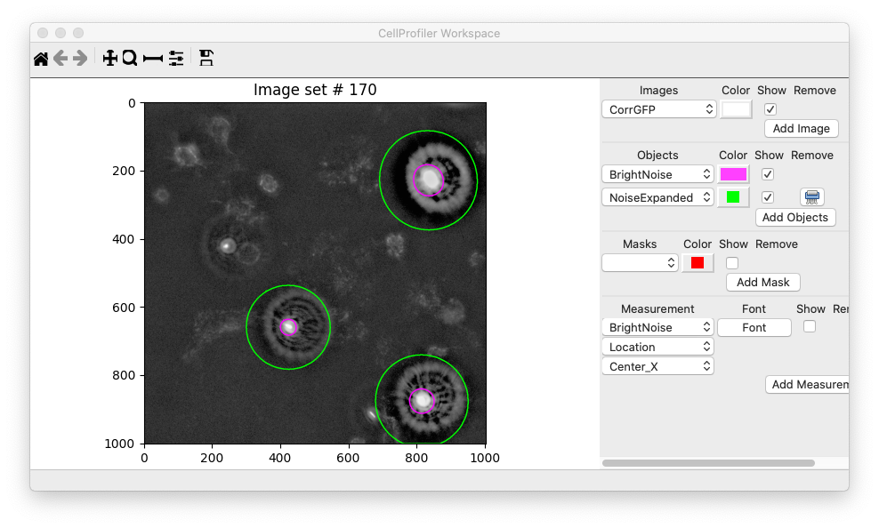

Another example image:
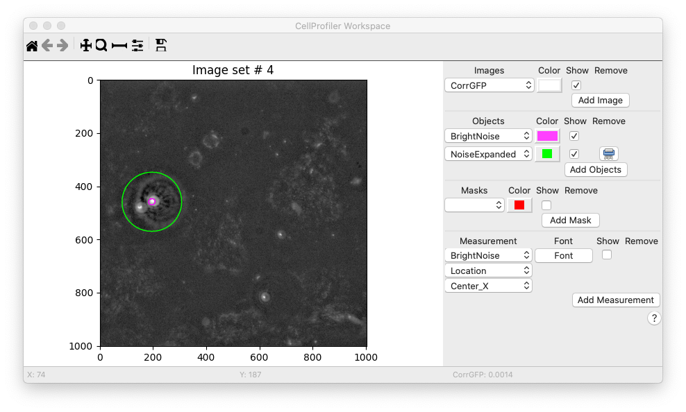

These expanded objects will be used as a mask within the MaskImage module to prevent them from being included in the analysis. Building this aspect of the workflow was one of the most challenging aspects of building this pipeline.

##### Enhancing fibers for detection
Many of the fibers in these images have quite a low signal-to-noise ratio. I wanted to increase the signal-to-noise for these dim structures using the EnhanceOrSuppressFeatures module. From previous experience, I knew that the "Tubeness" method within the "Neurites" feature type was likely to work well. I was pleased by the initial results using a Smoothing scale of 2:
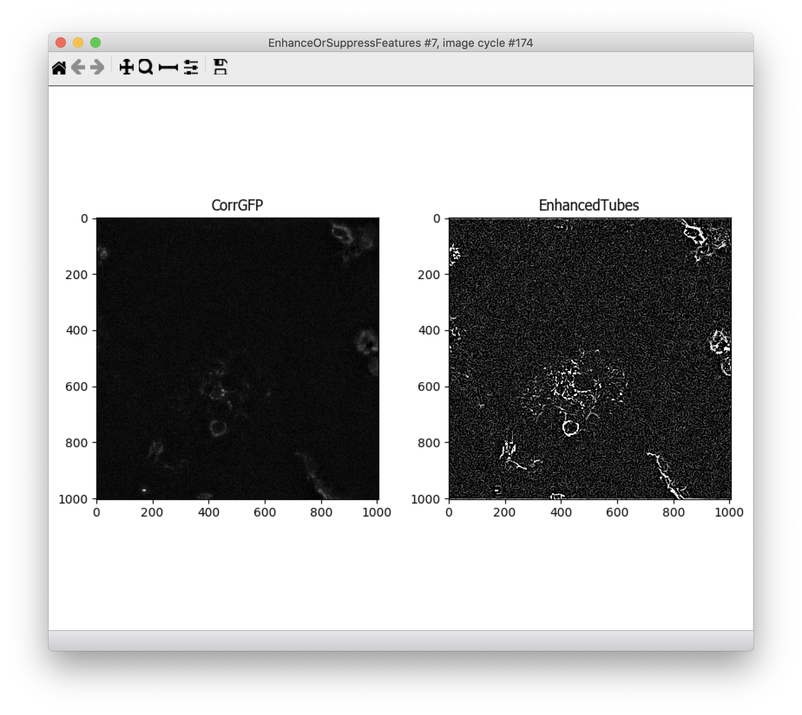

I also experimented with the "Line structures" method, which resulted in a lot of very bright noise in the background and didn't seem promising:
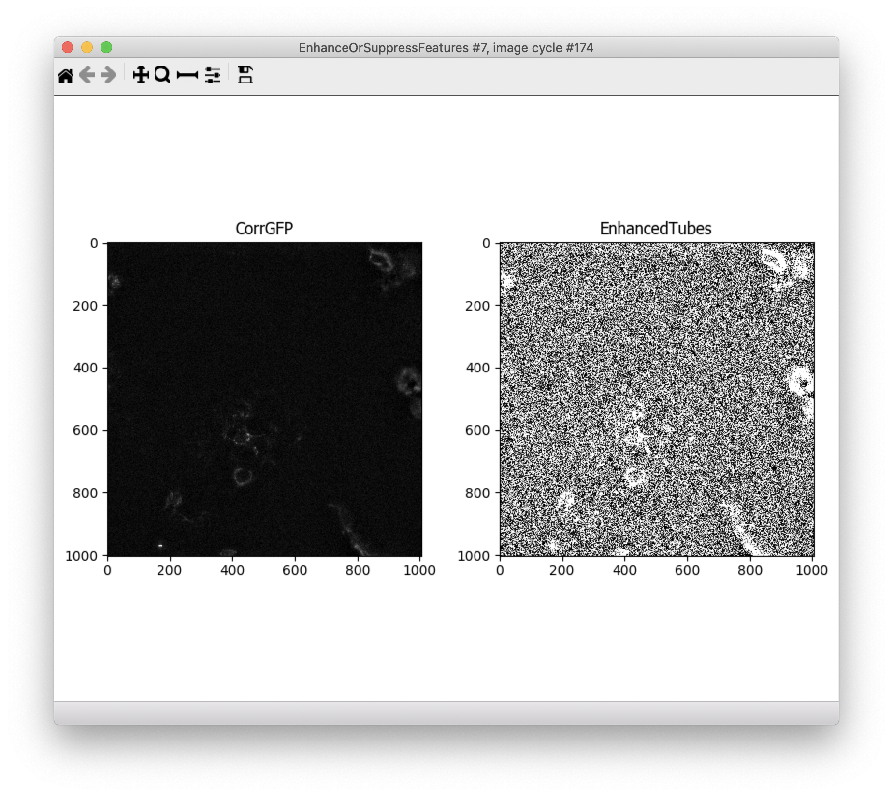

For that reason, I decided to stick with the Tubeness method. I did note that EnhanceOrSuppressFeatures picked up some background signal and create meaningless looking fibers -- the intensity of those maxes out at ~0.0175 vs ~.09 for the "real" fibrils:
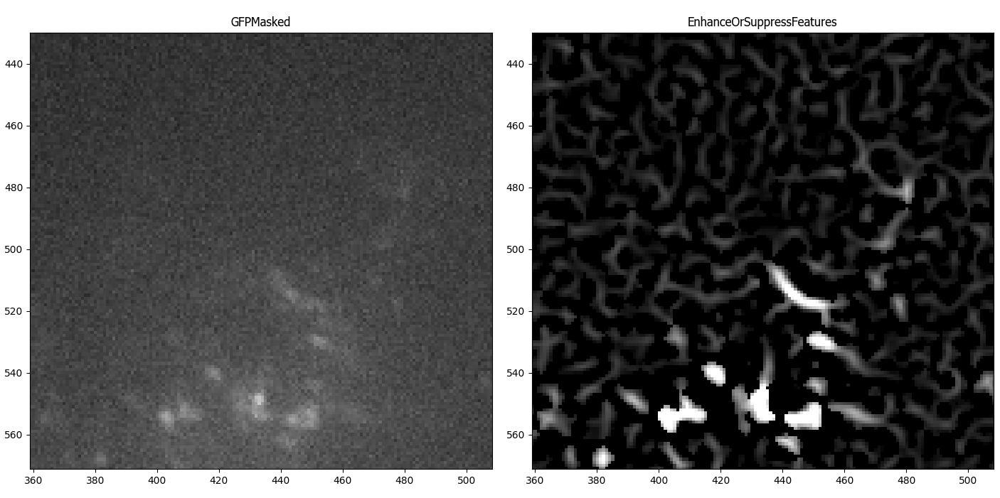

I decided to test if a background subtraction step would help reduce the intensity of those fibers created in the background. I was pleased to find that the small lines were still there, but there was greater contrast between them and the fibril signal:
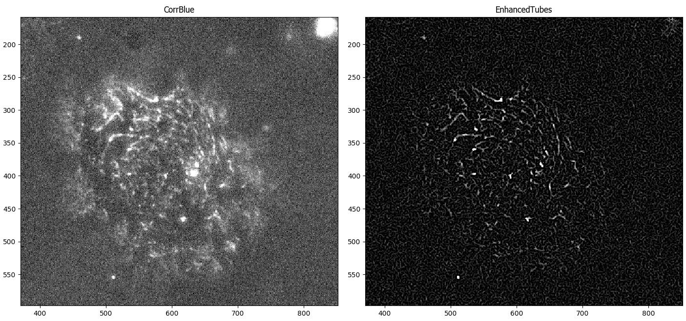

Ultimately, I wasn't too worried about these background fibers, since I was easily able to threshold the "true" signal away from this background using the w/ Robust Background method:
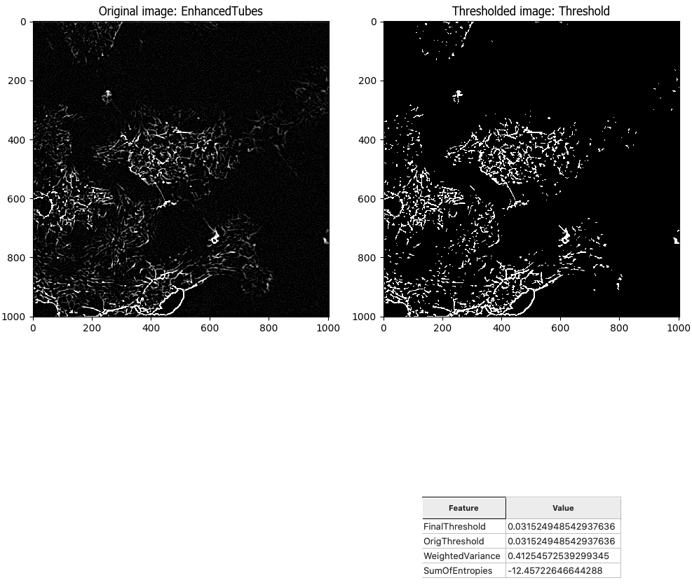

I applied the objects created above as a mask to this enhanced image. The resulting image is ready for fibril object detection using IdentifyPrimaryObjects!

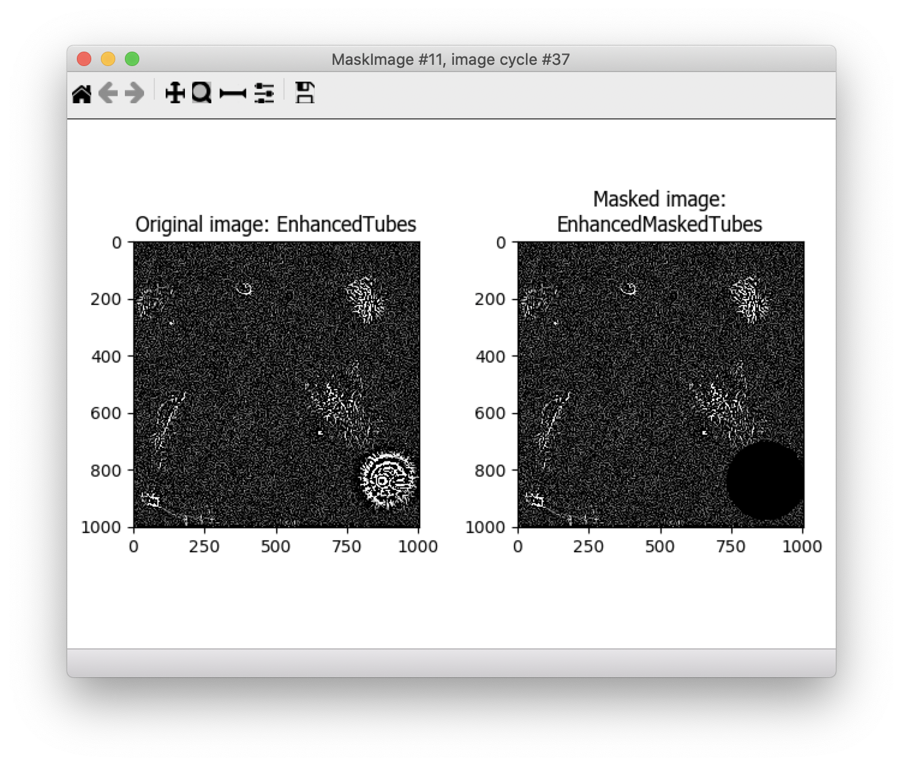

##### Detecting fibrils as objects
Next, I wanted to detect the fibrils as individual objects using IdentifyPrimaryObjects, which I can then measure for many different attributes such as area, length, width, etc.

Since the fibrils vary in intensity across the images and most of the image is background, I started with using Robust Background method for segmentation. Happily, the standard settings work well for thresholding. Since the image that we're segmenting on has been enhanced and masked, I used the Workspace viewer to assess the segmentation:

While I was happy with the detection of fibril vs. background, I noted that many of the longer fibrils were oversegmented (broken into too many pieces).
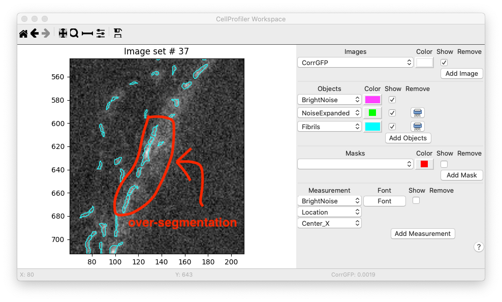

In order to avoid this oversegmentation, I set the smoothing filter and the minimum distance between local maxima manually, an adjustment we often need to make for fibrillar structures. I chose values of 30 for each, which greatly improved the segmentation results:

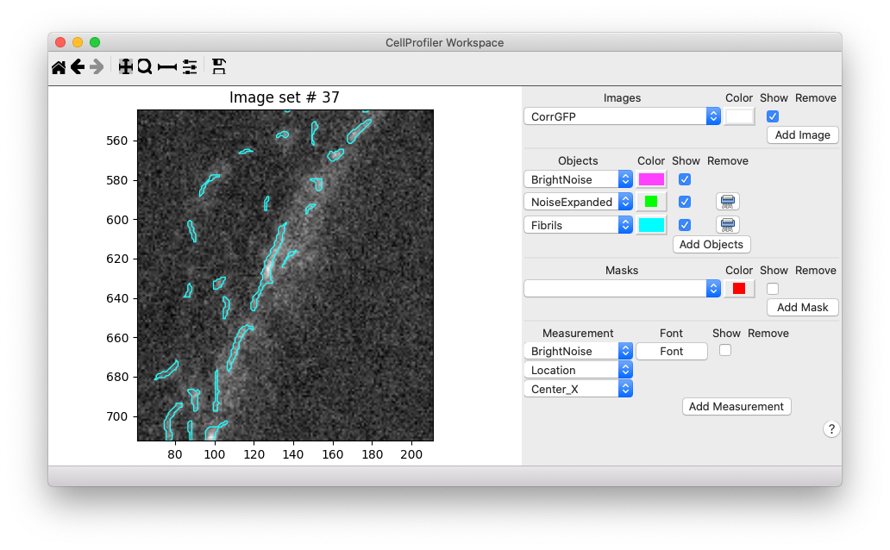

After examining this segmentation procedure on multiple images, I was happy with the segmentation results. My next step was to add an OverlayObjects module in order to quickly assess the segmentation across all images in the dataset before adding the measurement modules and exporting the data to a spreadsheet. I often take this approach for small-to-medium datasets where the entire set can be segmented in less than an hour on my computer. For larger datasets where that approach is too expensive (such as when I'm using a cluster to analyze the images), I assess the segmentation on more images before running the complete pipeline with measurements.

##### Cropping out the image edges
After running the segmentation on multiple images, I noted a common problem: many "fibrils" were detected in a horizontal line at the top of the image that probably weren't real. I had a suspicion that this resulted as an artifact from our edge filter. Sure enough, I could see an enhanced horizontal line of pixels at the top of the image that were within 10 pixels of the edge (these pixels weren't bright in the original image):

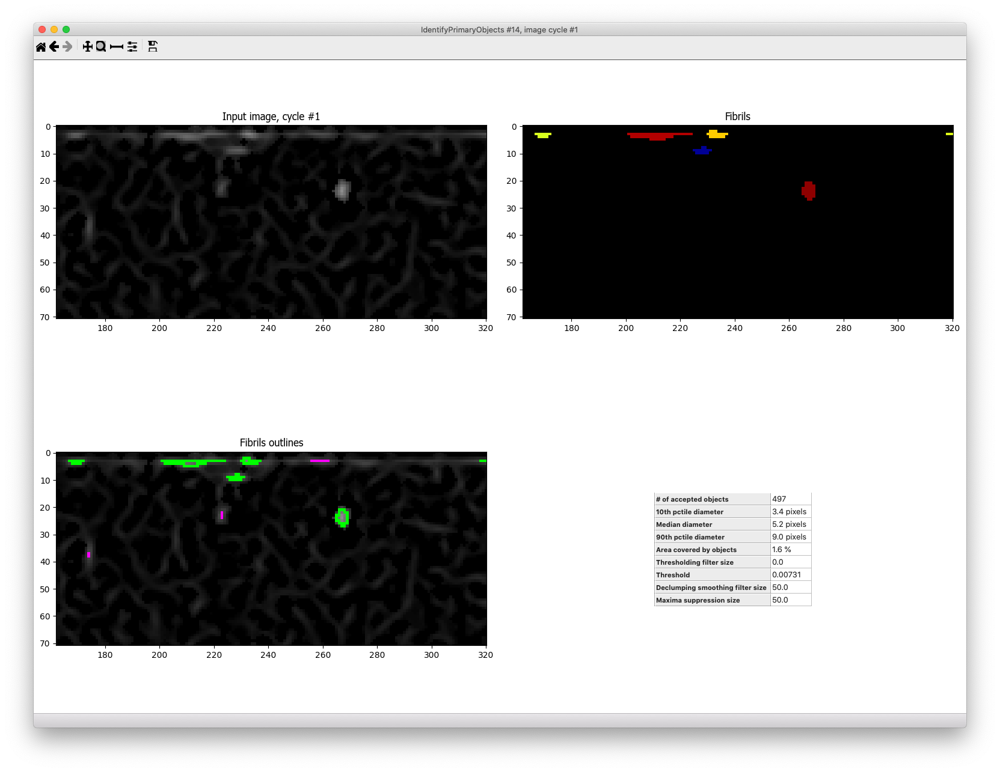

In order to get around this, I applied the Crop module eliminate 10 pixels from the edges of the image. I used the rectangle mode of Crop w/ "from edge" selected:

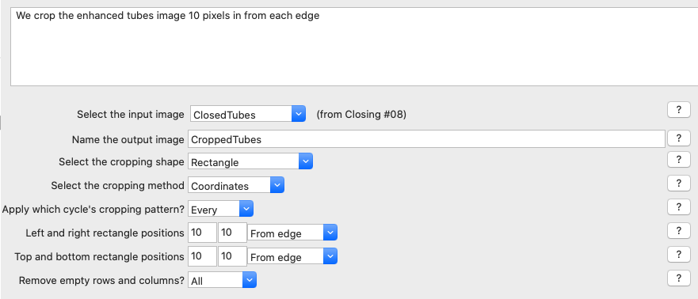

The resulting image no longer has the bright line enhanced at the top of the image and fibrils aren't detected as a line at the top of the image. Voila!:
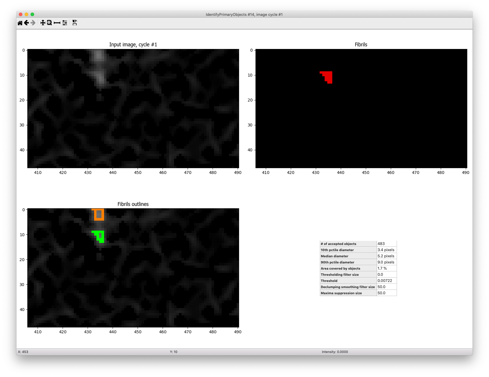

### Adding measurement modules and exporting the data
The final step of my pipeline is to add in the relevant measurement modules and save the data to spreadsheets. The MeasureObjectSizeShape module captures morphology measurements such as area, width, and length and the MeasureImageAreaOccupied measures the percentage of an image that contains fibrils. I also added a MeasureObjectSkeleton module in order to approximate the length of fibrils that bend or curve. Doing so requires first converting the fibril objects into a binary image using ConvertObjectsToImage, skeletonizing (shrinking the objects to a one-pixel wide line) the binary image using MorphologicalSkeleton, and then creating seeds for the MeasureObjectSkeleton module by shrinking the fibrils to a single point using ExpandOrShrinkObjects. The fibril skeleton can then be measured using MeasureObjectSkeleton.

A note: one thing I discovered when creating this pipeline is that small, round objects will have a skeleton length of zero, which reflects the thinning process thinning evenly from all sides (see below). In the data analysis for this project, I chose to filter out any skeleton lengths of 0, since it's probably not an accurate approximation of length. When working with fibrillar data and measuring length with MeasureObjectSkeleton, you may want to check for objects of skeleton length 0.
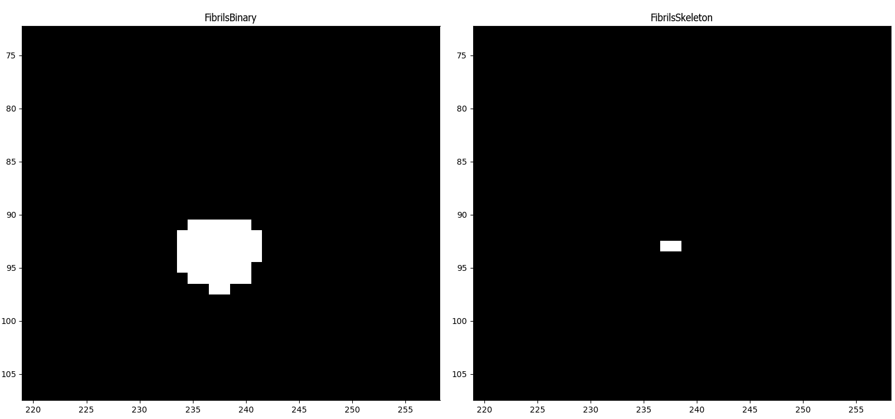

# Data analysis
With the pipeline complete, I applied it to the dataset by clicking "Analyze Images". The resulting measurements are stored in a folder named "cellprofiler-output."

I then analyzed the morphology of the fibrils using the fibril_analysis.ipynb Jupyter notebook in the "jupyter-notebook-for-data-analysis" folder. 
